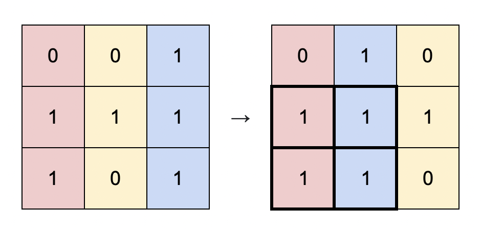
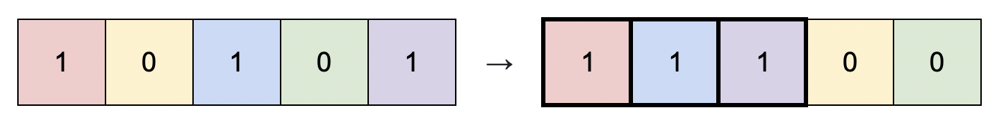

1727. Largest Submatrix With Rearrangements

You are given a binary matrix matrix of size m x n, and you are allowed to rearrange the columns of the matrix in any order.

Return the area of the largest submatrix within matrix where every element of the submatrix is 1 after reordering the columns optimally.

 

Example 1:

Input: matrix = [[0,0,1],[1,1,1],[1,0,1]]
Output: 4
Explanation: You can rearrange the columns as shown above.
The largest submatrix of 1s, in bold, has an area of 4.

Example 2:

Input: matrix = [[1,0,1,0,1]]
Output: 3
Explanation: You can rearrange the columns as shown above.
The largest submatrix of 1s, in bold, has an area of 3.

Example 3:

Input: matrix = [[1,1,0],[1,0,1]]
Output: 2
Explanation: Notice that you must rearrange entire columns, and there is no way to make a submatrix of 1s larger than an area of 2.

 

Constraints:

    m == matrix.length
    n == matrix[i].length
    1 <= m * n <= 105
    matrix[i][j] is either 0 or 1.

  
  

1727. Наибольшая подматрица с перестановками

Вам дана бинарная матрица размером m x n, и вы можете переставлять столбцы матрицы в любом порядке.

Верните площадь наибольшей подматрицы внутри матрицы, где каждый элемент подматрицы равен 1 после оптимальной перестановки столбцов.

Пример 1:

Входные данные: matrix = [[0,0,1],[1,1,1],[1,0,1]]
Выходные данные: 4
Пояснение: Вы можете переставлять столбцы, как показано выше.

Наибольшая подматрица из единиц, выделенная жирным шрифтом, имеет площадь 4.

Пример 2:

Входные данные: matrix = [[1,0,1,0,1]]
Выходные данные: 3
Пояснение: Вы можете переставить столбцы, как показано выше.

Наибольшая подматрица из единиц, выделенная жирным шрифтом, имеет площадь 3.

Пример 3:

Входные данные: matrix = [[1,1,0],[1,0,1]]
Выходные данные: 2
Пояснение: Обратите внимание, что необходимо переставлять целые столбцы, и нет способа сделать подматрицу из единиц больше, чем площадь 2.

Ограничения:

m == matrix.length
n == matrix[i].length
1 <= m * n <= 105
matrix[i][j] может быть либо 0, либо 1.