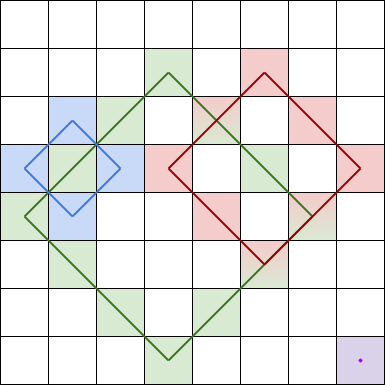
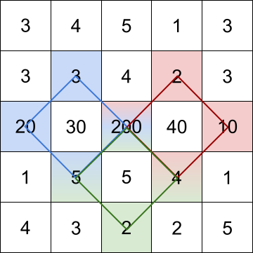
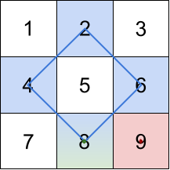

1878. Get Biggest Three Rhombus Sums in a Grid

You are given an m x n integer matrix grid​​​.

A rhombus sum is the sum of the elements that form the border of a regular rhombus shape in grid​​​. The rhombus must have the shape of a square rotated 45 degrees with each of the corners centered in a grid cell. Below is an image of four valid rhombus shapes with the corresponding colored cells that should be included in each rhombus sum:
 

Note that the rhombus can have an area of 0, which is depicted by the purple rhombus in the bottom right corner.

Return the biggest three distinct rhombus sums in the grid in descending order. If there are less than three distinct values, return all of them.

 

Example 1:
 

Input: grid = [[3,4,5,1,3],[3,3,4,2,3],[20,30,200,40,10],[1,5,5,4,1],[4,3,2,2,5]]
Output: [228,216,211]
Explanation: The rhombus shapes for the three biggest distinct rhombus sums are depicted above.
- Blue: 20 + 3 + 200 + 5 = 228
- Red: 200 + 2 + 10 + 4 = 216
- Green: 5 + 200 + 4 + 2 = 211

Example 2:
 

Input: grid = [[1,2,3],[4,5,6],[7,8,9]]
Output: [20,9,8]
Explanation: The rhombus shapes for the three biggest distinct rhombus sums are depicted above.
- Blue: 4 + 2 + 6 + 8 = 20
- Red: 9 (area 0 rhombus in the bottom right corner)
- Green: 8 (area 0 rhombus in the bottom middle)

Example 3:

Input: grid = [[7,7,7]]
Output: [7]
Explanation: All three possible rhombus sums are the same, so return [7].

 

Constraints:

    m == grid.length
    n == grid[i].length
    1 <= m, n <= 50
    1 <= grid[i][j] <= 105

  
  

1878. Получение трех наибольших сумм ромбов в сетке

Вам дана целочисленная матрица сетки размером m x n.

Сумма ромба — это сумма элементов, образующих границу правильного ромба в сетке. Ромб должен иметь форму квадрата, повернутого на 45 градусов, с каждым из углов, центрированных в ячейке сетки. Ниже приведено изображение четырех допустимых ромбов с соответствующими цветными ячейками, которые должны быть включены в каждую сумму ромба:
 

Обратите внимание, что площадь ромба может быть равна 0, что изображено фиолетовым ромбом в правом нижнем углу.

Верните три наибольшие различные суммы ромбов в сетке в порядке убывания. Если различных значений меньше трех, верните все значения.

Пример 1:
 

Входные данные: grid = [[3,4,5,1,3],[3,3,4,2,3],[20,30,200,40,10],[1,5,5,4,1],[4,3,2,2,5]]
Выходные данные: [228,216,211]
Пояснение: На рисунке выше изображены ромбовидные формы трех наибольших различных сумм ромбов.

- Синий: 20 + 3 + 200 + 5 = 228
- Красный: 200 + 2 + 10 + 4 = 216
- Зеленый: 5 + 200 + 4 + 2 = 211

Пример 2:
 

Входные данные: grid = [[1,2,3],[4,5,6],[7,8,9]]
Выходные данные: [20,9,8]
Пояснение: На рисунке выше изображены ромбовидные фигуры для трех наибольших различных сумм ромбов.

- Синий: 4 + 2 + 6 + 8 = 20
- Красный: 9 (область 0 ромба в правом нижнем углу)
- Зеленый: 8 (область 0 ромба в середине внизу)

Пример 3:

Входные данные: grid = [[7,7,7]]
Выходные данные: [7]
Пояснение: Все три возможные суммы ромбов одинаковы, поэтому возвращаем [7].

Ограничения:

m == grid.length

n == grid[i].length

1 <= m, n <= 50

1 <= grid[i][j] <= 105